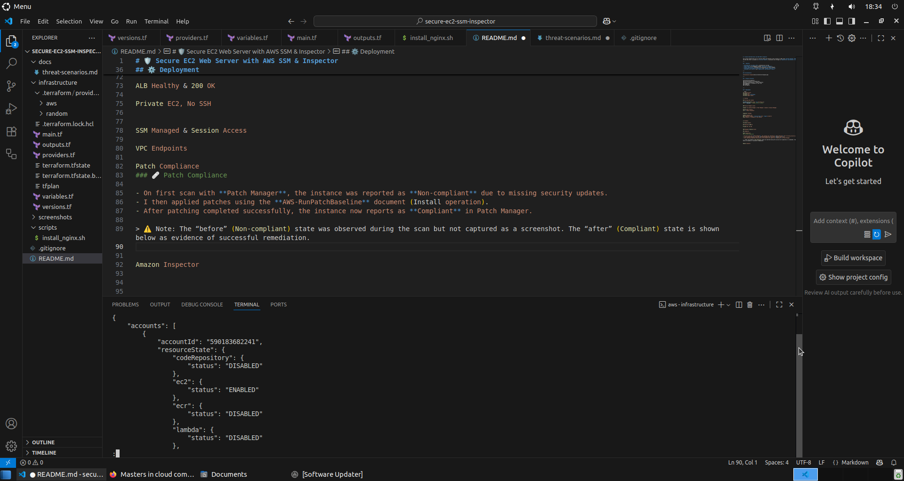

# 🛡 Secure EC2 Web Server with AWS SSM & Inspector

This project demonstrates how to securely deploy and operate an EC2 instance in AWS using **Systems Manager (SSM)** and **Amazon Inspector**.  
The EC2 web server is placed in a **private subnet**, accessible only through an **Application Load Balancer (ALB)**, with **zero-SSH management**.

---

## 🚀 Features

- **Private EC2 (no public IP)**, accessed only via ALB.  
- **Zero-SSH**: All management through **SSM Session Manager**.  
- **Patch compliance**: Automated scan association via Patch Manager.  
- **Continuous vulnerability detection** with **Amazon Inspector v2**.  
- **Scalable entry point** with **Application Load Balancer (ALB)**.  

---

## 🏗 Architecture


---

## 🗂 Project Structure

secure-ec2-ssm-inspector/
├── infrastructure/ # Terraform IaC
├── docs/ # Architecture + Threat Scenarios
├── screenshots/ # Evidence of test runs
├── README.md
└── .gitignore


---

## ⚙️ Deployment

```bash
cd infrastructure
terraform init
terraform plan -out=tfplan
terraform apply tfplan


🔍 Testing

ALB serving web content

ALB_URL=$(terraform output -raw alb_http_url)
curl -I $ALB_URL   # Expect HTTP/1.1 200 OK


SSM Session Manager access

Connect via Systems Manager → Fleet Manager → Connect → Session Manager.

Verify nginx locally:
curl -I http://localhost


Inspector Findings

Enable Inspector v2:
aws inspector2 enable --resource-types EC2 --region eu-west-2
View Inspector → Findings in the console.


📸 Evidence

Terraform Outputs

ALB Healthy & 200 OK

Private EC2, No SSH


SSM Managed & Session Access

VPC Endpoints

Patch Compliance
### 🩹 Patch Compliance

- On first scan with **Patch Manager**, the instance was reported as **Non-compliant** due to missing security updates.  
- I then applied patches using the **AWS-RunPatchBaseline** document (Install operation).  
- After patching completed successfully, the instance now reports as **Compliant** in Patch Manager.  

> ⚠️ Note: The “before” (Non-compliant) state was observed during the scan but not captured as a screenshot. The “after” (Compliant) state is shown below as evidence of successful remediation.


Amazon Inspector
### 🛡 Amazon Inspector

- Amazon Inspector v2 is **enabled** in the account and region.  
- The EC2 instance is successfully **covered** by Inspector (see coverage screenshot).  
- Because the instance was patched to compliance using Patch Manager, **no active CVEs were reported** at the time of testing.  
- This demonstrates a healthy security posture: Inspector continuously scans, but with all updates applied the system is currently in a **Compliant and secure state**.  

📸 Evidence:  
- 


